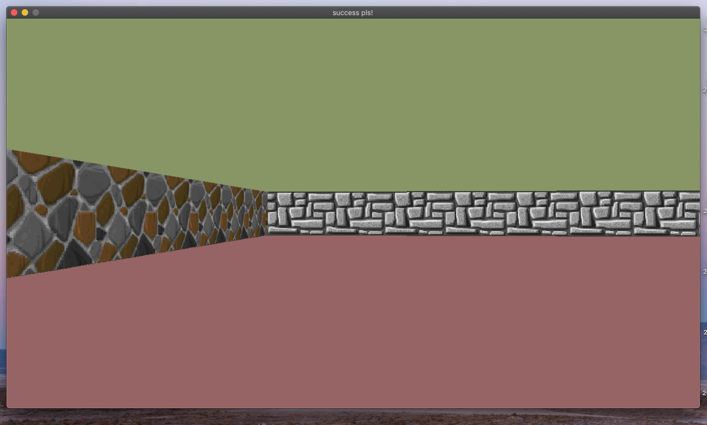

# raycast-engine

## Description
It's a “realistic” 3D graphical representation of the inside of a maze from a first person perspective. This made by using the Ray-casting principles.

It was made due to my studying in 21-school, Russia.
The main goal of project - learn what is ray-casting is and make a program, which represents a walking into maze.

## Requirements

#### MacOS

To clone project

* `git clone https://github.com/nakem1/raycast-engine`

To play run

* `make` or `make bonus`

* `./cub3D ./maps/conf.cub`

(In general second argument is a path to config file .cub)

## Config file

In general config file contains info about

* Screen resolution. If written resolution is bigger than your screen it will fit to your maximum possible resolution

* Textrures for Notrh, South, East, West walls and sprite in .xpm files

* Ceiling and floor color in R,G,B format

* Map where `1` - wall `0` - empty space `NWES` - initial directoin of a player `2` - sprite

## --save

In addition you can save a "screenshot" (in .bmp format) of first player view in game by adding `--save` argument to run command.

`./cub3D configs/conf.cub --save`

Screenshot wiil appear in project root directory.
